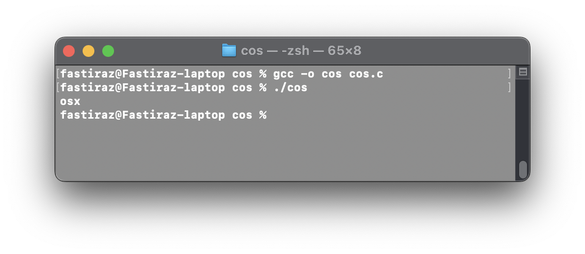

# Code Description
The code defines a function `get_platform_name()` that determines the platform of the operating system and returns its name. The platform name is determined based on preprocessor macros that are defined for different operating systems. The function returns a string with the name of the platform.

# Platform Names
The following platform names are defined in the code:

- `windows`: Windows
- `android`: Android
- `linux`: Debian, Ubuntu, Gentoo, Fedora, openSUSE, RedHat, Centos and other Linux distributions
- `bsd`: FreeBSD, NetBSD, OpenBSD, DragonFly BSD
- `hp-ux`: HP-UX
- `aix`: IBM AIX
- `ios`: Apple iOS or OSX, depending on the target platform
- `solaris`: Oracle Solaris, Open Indiana

If the platform cannot be determined, the function returns an empty string.

# Usage
The code can be compiled and run as a C program. When executed, the `get_platform_name()` function is called and the platform name is printed to the console using the `puts()` function.

